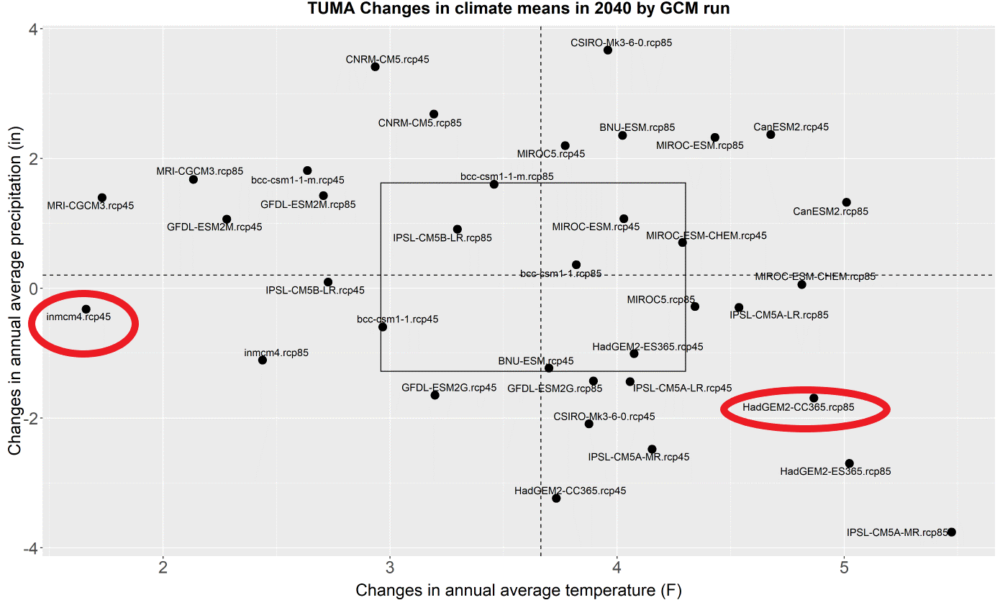

```{r setup, include=FALSE}
knitr::opts_chunk$set(echo = FALSE, warning = FALSE, message = FALSE)
```


```{r}
# -------------
# attach packages
# -------------

library(data.table) 
library(here)
#library(plyr) 
# be careful with this, it causes issues for dplyr::group_by
# I didn't try, but the internet says if you load it before tidyverse, that issue goes away
library(tidyverse)
library(beepr)
library(lubridate)
library(directlabels)
library(data.table)
library(ggbeeswarm)
library(gghalves)
library(directlabels)
library(ggrepel)
library(splines)
library(magrittr)

# -----------
# set global options
# -----------

#set theme for all graphs
theme_set(theme_classic() + #has the L shape around the graph
            theme(panel.grid = element_blank(), #removes grid lines
                  plot.title = element_text(size = 25), #title of plot text size
                  legend.text = element_text(size = 15), #legend inside text size
                  legend.title = element_text(size = 18), #legend title text size
                  axis.title.y = element_text(size = 15), #changes y axis lable text size
                  axis.text.x = element_text(size = 15), #changes x-axis text size
                  axis.text.y = element_text(size = 15), #changes y-axis text size
                  legend.position = "top"))

# ------------
# set variables for the data and code
# all of this should be changed before the model is run for a new site
# ------------

site = "quitobaquito" 

lat = 31.942809

lon = -113.020708

start = 1980 

end = 2019 

model_bc = "inmcm4" 

model_bc_rcp = "RCP 4.5"

model_wc = "HadGEM2-CC365"

model_wc_rcp = "RCP 8.5"

# model options: CCSM4, inmcm4, NorESM1-M, MRI-CGCM3, MIROC5, IPSL-CM5A-LR,  HadGEM2-CC365, GFDL-ESM2G, CanESM2, CSIRO-Mk3-6-0, CNRM-CM5, BNU-ESM, 

past_data = "gridmet"

# past_data options: "gridmet", "daymet"

```

# Water balance graphs for different climate futures

We used information from a nearby location, Tumacacori which is south of Tuscon, approximately 200 miles from Quitobaquito to look at the range of possible climate futures in the area. After evaluating this information, we chose two climate futures that are distinctly different - `r model_bc` `r model_bc_rcp` to display projections for a future that is hotter and drier, and `r model_wc``r model_wc_rcp` to display projections for a future that is *much* hotter and *much* drier. 

Data is based on water balance data projections from Mike Tercek. 




These charts represent seasonality of and annual average of time series. The graphs that show this time series by day of year represent changes in timing and magnitude throughout the year. The graphs of annual averages until 2100 represent changes over time, and display what the climate may look like by the end of this century.


```{r}
# ------------
# DAILY DATA
# clean data for graphing
# ------------

# ------------
# daily future data
# ------------

mixed_model_bc <- read_csv(here::here(site,
                                  "raw_data",
                                  paste("lat",lat,"lon",lon, sep = "_"),
                                  "future_daily",
                                  paste(site, model_bc,"daily_future.csv", sep = "_")),
                    na = c("-3276.7")) %>% 
  select(date:lon, soil_water_daily_45:aet_daily_45, -agdd_daily_45) # fix this, put agdd back in when it is back

colnames(mixed_model_bc)[]<-c("date", "lat","lon","soil_water_daily_bc", "runoff_daily_bc", "rain_daily_bc", "accumswe_daily_bc", "pet_daily_bc", "deficit_daily_bc", "aet_daily_bc")

# divide.by.10 <- function(x, na.rm = FALSE) {
#   x/10
# }
# 
# mixed_model_bc <- mixed_model_bc_1 %>% 
#   mutate(lat = as.character(lat),
#          lon = as.character(lon)) %>% 
#   mutate_if(is.numeric, divide.by.10)

mixed_model_wc <- read_csv(here::here(site,
                                  "raw_data",
                                  paste("lat",lat,"lon",lon, sep = "_"),
                                  "future_daily",
                                  paste(site, model_wc,"daily_future.csv", sep = "_")),
                    na = c("-3276.7"))

colnames(mixed_model_wc)[]<-c("date", "lat","lon","soil_water_daily_wc", "runoff_daily_wc", "rain_daily_wc", "accumswe_daily_wc", "pet_daily_wc", "deficit_daily_wc", "aet_daily_wc")


future_day_1 <- mixed_model_bc %>% 
  inner_join(mixed_model_wc)

write_csv(as_tibble(future_day_1, here::here(site,
                                  "raw_data",
                                  paste("lat",lat,"lon",lon, sep = "_"),
                                  "future_daily",
                                  paste(site, model_wc, model_wc_rcp, model_bc, model_bc_rcp, "daily_future.csv", sep = "_"))))

date_fd <- future_day_1$date
# this is a work around
# want to remove data that has all zeroes conditionally based on lat and lon
# couldn't get data to work to only remove data that had a sum of zero unless removed all non-variable columns


future_day <- future_day_1 %>% 
  select(-lat, -lon, -date)  %>%
  select(which(!colSums(., na.rm = TRUE) %in% c(0))) %>% # this removes variable that sum to zero (i.e. accumswe in a hot climate)
  mutate(date = date_fd,
    year = lubridate::year(date), 
    month = lubridate::month(date,
                             label = TRUE,
                             abbr = TRUE),
    day = lubridate::day(date),
    doy = yday(date))


# ------------
# daily past
# ------------

# divide.by.10 <- function(x, na.rm = FALSE) {
#   x/10
# }

past_day_1 <- read_csv(here::here(site,
                                  "raw_data",
                                  paste("lat",lat,"lon",lon, sep = "_"),
                                  "historical_daily"),
                           na = c("-3276.7"))


date_pd <- past_day_1$date# this is a work around
# want to remove data that has all zeroes conditionally based on lat and lon
# couldn't get data to work to only remove data that had a sum of zero unless removed all non-variable columns

past_day <- past_day_1 %>% 
  select(-lat, -lon, -date)  %>%
  select(which(!colSums(., na.rm = TRUE) %in% c(0))) %>% # this removes variable that sum to zero (i.e. accumswe in a hot climate)
  mutate(date = date_pd,
         year = lubridate::year(date),
         month = lubridate::month(date,
                                  label = TRUE,
                                  abbr = TRUE),
         day = lubridate::day(date),
         doy = yday(date)) 


```

```{r}

# -------------
# Make site data into long format
# -------------

# -------------
# long format past data daily
# -------------

site_long_past <- past_day %>% 
  pivot_longer(`soil_water_daily`:`aet_daily`, # The columns I'm gathering together
               names_to = "variable", # new column name for existing names
               values_to = "value") %>% # new column name to store values
  mutate(variable = case_when(
    .$variable == "runoff_daily" ~ "Runoff",
    #.Svariable calls the variable, then it can be renamed
    .$variable == "agdd_daily" ~ "AGDD",
    .$variable == "soil_water_daily" ~ "Soil Water",
    .$variable == "rain_daily" ~ "Rain",
    .$variable == "accumswe_daily" ~ "Accumulated SWE",
    .$variable == "pet_daily" ~ "PET",
    .$variable == "deficit_daily" ~ "Deficit",
    TRUE ~ "AET" # last ifelse is just labeled as TRUE
  )) %>% 
  mutate(decade = case_when(
    .$year %in% c(1980:1989) ~ "1980s",
    .$year %in% c(1990:1999) ~ "1990s",
    .$year %in% c(2000:2009) ~ "2000s",
    TRUE ~ "2010s"
  )) 

annual_past <- site_long_past %>% 
  group_by(variable, year) %>% 
  mutate(annual_avg = mean(value, na.rm = TRUE))

# -------------
# long format future data daily
# -------------

site_long_wc <- future_day %>%
  select(soil_water_daily_wc:aet_daily_wc, date:doy) %>% # selecting for variables for wc only
  pivot_longer(`soil_water_daily_wc`:`aet_daily_wc`, # The columns I'm gathering together
               names_to = "variable", # new column name for existing names
               values_to = "rcp_wc") %>%  
  filter(!year == 2100) %>%
  mutate(variable = case_when(
    .$variable == "runoff_daily_wc" ~ "Runoff",
    #.Svariable calls the variable, then it can be renamed
    .$variable == "agdd_daily_wc" ~ "AGDD",
    .$variable == "soil_water_daily_wc" ~ "Soil Water",
    .$variable == "rain_daily_wc" ~ "Rain",
    .$variable == "accumswe_daily_wc" ~ "Accumulated SWE",
    .$variable == "pet_daily_wc" ~ "PET",
    .$variable == "deficit_daily_wc" ~ "Deficit",
    TRUE ~ "AET")) %>% 
  mutate(decade = case_when(
    .$year %in% c(2020:2029) ~ "2020s",
    .$year %in% c(2030:2039) ~ "2030s",
    .$year %in% c(2040:2049) ~ "2040s",
    .$year %in% c(2050:2059) ~ "2050s",
    .$year %in% c(2060:2069) ~ "2060s",
    .$year %in% c(2070:2079) ~ "2070s",
    .$year %in% c(2080:2089) ~ "2080s",
    TRUE ~ "2090s"
  ))

annual_future_wc <- site_long_wc %>% 
  group_by(variable, year) %>% 
  mutate(annual_avg_wc = mean(rcp_wc, na.rm = TRUE)) %>%
  ungroup(year, variable) 

  
  
site_long_bc <- future_day %>% 
  select(soil_water_daily_bc:aet_daily_bc, date:doy) %>% #selecting for 4.5 only
  pivot_longer(`soil_water_daily_bc`:`aet_daily_bc`, # The columns I'm gathering together
               names_to = "variable", # new column name for existing names
               values_to = "rcp_bc") %>% 
  filter(!year == 2100) %>% 
  mutate(variable = case_when(
    .$variable == "runoff_daily_bc" ~ "Runoff",
    #.Svariable calls the variable, then it can be renamed
    .$variable == "agdd_daily_bc" ~ "AGDD",
    .$variable == "soil_water_daily_bc" ~ "Soil Water",
    .$variable == "rain_daily_bc" ~ "Rain",
    .$variable == "accumswe_daily_bc" ~ "Accumulated SWE",
    .$variable == "pet_daily_bc" ~ "PET",
    .$variable == "deficit_daily_bc" ~ "Deficit",
    TRUE ~ "AET" # last ifelse is just labeled as TRUE
  )) %>% 
  mutate(decade = case_when(
    .$year %in% c(2020:2029) ~ "2020s",
    .$year %in% c(2030:2039) ~ "2030s",
    .$year %in% c(2040:2049) ~ "2040s",
    .$year %in% c(2050:2059) ~ "2050s",
    .$year %in% c(2060:2069) ~ "2060s",
    .$year %in% c(2070:2079) ~ "2070s",
    .$year %in% c(2080:2089) ~ "2080s",
    TRUE ~ "2090s"
  ))

annual_future_bc <- site_long_bc %>% 
   group_by(variable, year) %>% 
  mutate(annual_avg_bc = mean(rcp_bc, na.rm = TRUE)) %>%
  ungroup(year, variable) 


annual_future <- annual_future_bc %>%
  full_join(annual_future_wc)


```


```{r}
day_join_1980_2019 <-  past_day %>% 
  filter(year %in% c(1980:2019)) %>%
  pivot_longer(`soil_water_daily`:`aet_daily`, # The columns I'm gathering together
               names_to = "variable", # new column name for existing names
               values_to = "value") # new column name to store values) 

day_join_1980_2019_d <- day_join_1980_2019 %>% #for grouping by doy
  group_by(doy, variable) %>% 
  summarize(`1980-2019` = mean(value, na.rm = TRUE))

day_join_1980_2019_m <- day_join_1980_2019 %>% #for grouping by month
  group_by(month, year, variable) %>% 
  summarize(`1980-2019` = sum(value, na.rm = TRUE))

# --------
# RCP 4.5 means
# --------

# 2020 - 2059 RCP 4.5
# first, rename variables to be able to combine them later

day_join_2020_2059_bc <- future_day %>% 
  filter(year %in% c(2020:2059)) %>%
  select(soil_water_daily_bc:doy) %>% 
  pivot_longer(`soil_water_daily_bc`:`aet_daily_bc`, # The columns I'm gathering together
               names_to = "variable", # new column name for existing names
               values_to = "value") %>% # new column name to store values)
  mutate(variable = case_when(.$variable == "aet_daily_bc" ~ "aet_daily",
    .$variable == "rain_daily_bc" ~ "rain_daily",
    .$variable == "runoff_daily_bc" ~ "runoff_daily",
    .$variable == "pet_daily_bc" ~ "pet_daily",
    .$variable == "accumswe_daily_bc" ~ "accumswe_daily",
    .$variable == "soil_water_daily_bc" ~ "soil_water_daily",
    .$variable == "agdd_daily_bc" ~ "agdd_daily",
    TRUE ~ "deficit_daily")) 

#for grouping by doy

day_join_2020_2059_bc_d <- day_join_2020_2059_bc %>% 
  group_by(doy, variable) %>% 
  summarize(`2020-2059` = mean(value, na.rm = TRUE)) 

#for grouping by month

day_join_2020_2059_bc_m <- day_join_2020_2059_bc %>% 
  group_by(month, year, variable) %>% 
  summarize(`2020-2059` = sum(value, na.rm = TRUE))

# 2060 - 2099 RCP 4.5 df
# first, rename variables to be able to combine them later

day_join_2060_2099_bc <-  future_day %>% 
  filter(year %in% c(2060:2099)) %>%
  select(soil_water_daily_bc:doy) %>%
  pivot_longer(`soil_water_daily_bc`:`aet_daily_bc`, # The columns I'm gathering together
               names_to = "variable", # new column name for existing names
               values_to = "value") %>%  # new column name to store values) 
  mutate(variable = case_when(.$variable == "aet_daily_bc" ~ "aet_daily",
    .$variable == "rain_daily_bc" ~ "rain_daily",
    .$variable == "runoff_daily_bc" ~ "runoff_daily",
    .$variable == "pet_daily_bc" ~ "pet_daily",
    .$variable == "accumswe_daily_bc" ~ "accumswe_daily",
    .$variable == "soil_water_daily_bc" ~ "soil_water_daily",
    .$variable == "agdd_daily_bc" ~ "agdd_daily",
    TRUE ~ "deficit_daily"))

#for grouping by doy

day_join_2060_2099_bc_d <- day_join_2060_2099_bc %>% #for grouping by doy
  group_by(doy, variable) %>% 
  summarize(`2060-2099` = mean(value, na.rm = TRUE)) 

#for grouping by month

day_join_2060_2099_bc_m <- day_join_2060_2099_bc %>% #for grouping by month
  group_by(month, year, variable) %>% 
  summarize(`2060-2099` = sum(value, na.rm = TRUE))

#full doy dataframe RCP 4.5

day_join_bc_d <- day_join_1980_2019_d %>% 
  full_join(day_join_2020_2059_bc_d) %>% 
  full_join(day_join_2060_2099_bc_d) %>% 
  pivot_longer(`1980-2019`:`2060-2099`, # The columns I'm gathering together
               names_to = "decades", # new column name for existing names
               values_to = "value") %>% # new column name to store values 
  na.omit(day_join_bc_d) %>%  # because of the way the dataframe was made, there's NA's for second and third 40, just don't want those there
  pivot_wider(names_from = variable,
              values_from = value) 

#full month dataframe RCP 4.5

day_join_bc_m <- day_join_1980_2019_m %>% 
  full_join(day_join_2020_2059_bc_m) %>% 
  full_join(day_join_2060_2099_bc_m) %>% 
  pivot_longer(`1980-2019`:`2060-2099`, # The columns I'm gathering together
               names_to = "decades", # new column name for existing names
               values_to = "value") %>% # new column name to store values 
  na.omit(day_join_bc_m)   # because of the way the dataframe was made, there's NA's for second and third 40, just don't want those there
  # pivot_wider(names_from = variable,
  #             values_from = value) # I think I want this df in long format


# --------
# RCP 8.5 means
# --------

# 2020 - 2059 RCP 8.5 df
# first, rename variables to be able to combine them later

day_join_2020_2059_wc <- future_day %>% 
  filter(year %in% c(2020:2059)) %>%
  select(soil_water_daily_wc:doy) %>% 
  pivot_longer(`soil_water_daily_wc`:`aet_daily_wc`, # The columns I'm gathering together
               names_to = "variable", # new column name for existing names
               values_to = "value") %>% # new column name to store values)
  mutate(variable = case_when(.$variable == "aet_daily_wc" ~ "aet_daily",
    .$variable == "rain_daily_wc" ~ "rain_daily",
    .$variable == "runoff_daily_wc" ~ "runoff_daily",
    .$variable == "pet_daily_wc" ~ "pet_daily",
    .$variable == "accumswe_daily_wc" ~ "accumswe_daily",
    .$variable == "soil_water_daily_wc" ~ "soil_water_daily",
    .$variable == "agdd_daily_wc" ~ "agdd_daily",
    TRUE ~ "deficit_daily"))   
  
#for grouping by doy
  
day_join_2020_2059_wc_d <- day_join_2020_2059_wc %>% 
  group_by(doy, variable) %>% 
  summarize(`2020-2059` = mean(value, na.rm = TRUE)) 

#for grouping by month
# data that uses month needs median

day_join_2020_2059_wc_m <- day_join_2020_2059_wc %>% 
  group_by(month, year, variable) %>%
  #if i group_by month and variable only, there won't be multiple observations
  #I think that the data online is the mean of months
  #if i don't use mean, many values are zero?
  # my boxplot data will be a median of means?
  summarize(`2020-2059` = mean(value, na.rm = TRUE)) 

# 2060 - 2099 RCP 8.5 df
# first, rename variables to be able to combine them later

day_join_2060_2099_wc <-  future_day %>% 
  filter(year %in% c(2060:2099)) %>%
  select(soil_water_daily_wc:doy) %>%
  pivot_longer(`soil_water_daily_wc`:`aet_daily_wc`, # The columns I'm gathering together
               names_to = "variable", # new column name for existing names
               values_to = "value") %>%  # new column name to store values) 
  mutate(variable = case_when(.$variable == "aet_daily_wc" ~ "aet_daily",
    .$variable == "rain_daily_wc" ~ "rain_daily",
    .$variable == "runoff_daily_wc" ~ "runoff_daily",
    .$variable == "pet_daily_wc" ~ "pet_daily",
    .$variable == "accumswe_daily_wc" ~ "accumswe_daily",
    .$variable == "soil_water_daily_wc" ~ "soil_water_daily",
    .$variable == "agdd_daily_wc" ~ "agdd_daily",
    TRUE ~ "deficit_daily"))

#for grouping by doy

day_join_2060_2099_wc_d <- day_join_2060_2099_wc %>% 
  group_by(doy, variable) %>% 
  summarize(`2060-2099` = mean(value, na.rm = TRUE)) 

#for grouping by month
# graphs that use months will use the median

day_join_2060_2099_wc_m <- day_join_2060_2099_wc %>% 
  group_by(month,year, variable) %>% 
  summarize(`2060-2099` = mean(value, na.rm = TRUE)) 

#full day dataset RCP 8.5

day_join_wc_d <- day_join_1980_2019_d %>% 
  full_join(day_join_2020_2059_wc_d) %>% 
  full_join(day_join_2060_2099_wc_d) %>% 
  pivot_longer(`1980-2019`:`2060-2099`, # The columns I'm gathering together
               names_to = "decades", # new column name for existing names
               values_to = "value") %>% # new column name to store values 
  na.omit(day_join_wc_d) %>%  # because of the way the dataframe was made, there's NA's for second and third 40, just don't want those there
  pivot_wider(names_from = variable,
              values_from = value) 

#full month dataframe RCP 8.5

day_join_wc_m <- day_join_1980_2019_m %>% 
  full_join(day_join_2020_2059_wc_m) %>% 
  full_join(day_join_2060_2099_wc_m) %>% 
  pivot_longer(`1980-2019`:`2060-2099`, # The columns I'm gathering together
               names_to = "decades", # new column name for existing names
               values_to = "value") %>% # new column name to store values 
  na.omit(day_join_wc_m)   # because of the way the dataframe was made, there's NA's for second and third 40, just don't want those there
  # pivot_wider(names_from = variable,
  #             values_from = value) # i think I want this df in long format


```


```{r}
# -------
# Function for 40 yr chunks - line graph by doy
# -------

  
plot_decades_smooth = function(.y) { #start function
  
max_y_1 <- day_join_bc_d %>%
    inner_join(day_join_wc_d) %>%
  select(.y)


max_y_2 <- max(max_y_1[,2], na.rm = TRUE)

max_y <- max_y_2*1.15
  
  exists_.y <- exists(.y, where = day_join_bc_d) #check to see if the variable exists
  
  if(exists_.y == TRUE){ #start if statement RCP 4.5
  
  .y_plot_bc <- ggplot(day_join_bc_d) + 
    geom_smooth(size = 1.5,
                se = FALSE,
                aes(x = doy,
                    y = .data[[.y]],
                    # calling my variable, which I'll name later in the command
                    group = decades,
                    color = decades),
                method = glm,
                family = quasipoisson,
                formula = y ~ ns(x, 15)) +
    #internet said to do this
    #quasipoisson is some type of statistical analysis type
    #forumula has something to do with the degrees of freedom
    #https://stackoverflow.com/questions/2777053/in-ggplot-restrict-y-to-be-0-in-loess
    # geom_vline(data = day_join_bc_d,
    #            xintercept = doy[.data[[.y]] == max(.data[[.y]])], color='red') +
    labs(x = "Day of Year",
         color = "Year",
         y = ifelse(.y == "agdd_daily", "Growing Degree Days (C)", "Water (mm)"), 
         # R needs the "" here
         # the ifelse goes after the command you want to change
         #.y is useful because it prevents R from confusing it with something else
         # purrr is much more useful than a for loop here
         # if {} else{} and if_else() both didn't work, but I don't know why
         title = case_when(.y ==  "soil_water_daily" ~ paste("Soil Water", 
                                                             model_bc, model_bc_rcp), #title based on variable
                           .y == "runoff_daily" ~ paste("Runoff", 
                                                        model_bc, model_bc_rcp),
                           .y == "rain_daily" ~ paste("Rain", 
                                                      model_bc, model_bc_rcp),
                           .y == "agdd_daily" ~ paste("Accumulated Growing Degree Days",
                                                      "\n-", model_bc, model_bc_rcp),
                           .y == "accumswe_daily"~ paste("Accumulated SWE", 
                                                         "\n-", model_bc, model_bc_rcp),
                           .y == "pet_daily" ~ paste(" Potential Evapotranspiration",
                                                     "\n-", model_bc, model_bc_rcp),
                           .y == "deficit_daily" ~ paste("Deficit", 
                                                         model_bc, model_bc_rcp),
                           TRUE ~ paste("Actual Evapotranspiration", 
                                        "\n-", model_bc, model_bc_rcp))) + 
    scale_color_manual(breaks = c("1980-2019", "2020-2059", "2060-2099"),
                       values = c("turquoise4", "darkolivegreen3", "darkgoldenrod3"))+
    theme(axis.title.x = element_text(size = 15)) +
  ylim(NA, max_y)
  
  
  ggsave(here::here("figures", #top folder
                    site, # site subfolder
                    paste("lat",lat,"lon",lon, sep = "_"),
                    "40_yr_graphs", # subfolder
                    paste(.y, "40_yr_bc", ".png", sep = "_"))) #file name
  
  print(.y_plot_bc)
  
  } #end if statement for best case scenario
  
  exists_.y <- exists(.y, where = day_join_wc_d) #check to see if the variable exists
  
  if(exists_.y == TRUE){ #start if statement worst case scenario
  
  .y_plot_wc <- ggplot(day_join_wc_d) +
    stat_smooth(size = 1.5,
                se = FALSE,
                aes(x = doy,
                    y = .data[[.y]],
                    # calling my variable, which I'll name later in the command
                    group = decades,
                    color = decades),
                method = glm,
                family = quasipoisson,
                formula = y ~ ns(x, 15)) +
    #internet said to do this
    #quasipoisson is some type of statistical analysis type
    #forumula has something to do with the degrees of freedom
    #https://stackoverflow.com/questions/2777053/in-ggplot-restrict-y-to-be-0-in-loess
    #geom_vline(xintercept = doy[.data[[.y]] == max(.data[[.y]])],color='red') +
    labs(x = "Day of Year",
         color = "Year",
         y = ifelse(.y == "agdd_daily", "Growing Degree Days (C)", "Water (mm)"), 
         # R needs the "" here
         # the ifelse goes after the command you want to change
         #.y is useful because it prevents R from confusing it with something else
         # purrr is much more useful than a for loop here
         # if {} else{} and if_else() both didn't work, but I don't know why
         title = case_when(.y ==  "soil_water_daily" ~ paste("Soil Water", 
                                                             model_wc, model_wc_rcp), #title based on variable
                           .y == "runoff_daily" ~ paste("Runoff", 
                                                        model_wc, model_wc_rcp),
                           .y == "rain_daily" ~ paste("Rain", 
                                                      model_wc, model_wc_rcp),
                           .y == "agdd_daily" ~ paste("Accumulated Growing Degree Days",
                                                      "\n-", model_wc, model_wc_rcp),
                           .y == "accumswe_daily"~ paste("Accumulated SWE", 
                                                         model_wc, model_wc_rcp),
                           .y == "pet_daily" ~ paste("Potential Evapotranspiration",
                                                     "\n-", model_wc, model_wc_rcp),
                           .y == "deficit_daily" ~ paste("Deficit", 
                                                         model_wc, model_wc_rcp),
                           TRUE ~ paste("Actual Evapotranspiation", 
                                        "\n-", model_wc, model_wc_rcp))) +
    scale_color_manual(breaks = c("1980-2019", "2020-2059", "2060-2099"),
                       values = c("turquoise4", "darkolivegreen3", "darkgoldenrod3")) +
    theme(axis.title.x = element_text(size = 15)) +
    ylim(NA, max_y)
  
  ggsave(here::here("figures", #top folder
                    site, #site subfolder
                    paste("lat",lat,"lon",lon, sep = "_"),
                    "40_yr_graphs", # subfolder
                    paste(.y, "40_yr_wc", ".png", sep = "_"))) #file name
  
  print(.y_plot_wc)
  
  } #end if statement RCP 8.5

  
} #end function decades_smooth

plot_decades_line = function(.y) { #start function
  
  exists_.y <- exists(.y, where = day_join_bc_d) #check to see if the variable exists
  
  if(exists_.y == TRUE){ #start if statement RCP 4.5

.y_plot_bc <- ggplot(day_join_bc_d) + 
    geom_line(size = 1.5,
                aes(x = doy,
                    y = .data[[.y]],
                    # calling my variable, which I'll name later in the command
                    group = decades,
                    color = decades)) +
    #internet said to do this
    #quasipoisson is some type of statistical analysis type
    #forumula has something to do with the degrees of freedom
    #https://stackoverflow.com/questions/2777053/in-ggplot-restrict-y-to-be-0-in-loess
    # geom_vline(data = day_join_bc_d,
    #            xintercept = doy[.data[[.y]] == max(.data[[.y]])], color='red') +
    labs(x = "Day of Year",
         color = "Year",
         y = ifelse(.y == "agdd_daily", "Growing Degree Days (C)", "Water (mm)"), 
         # R needs the "" here
         # the ifelse goes after the command you want to change
         #.y is useful because it prevents R from confusing it with something else
         # purrr is much more useful than a for loop here
         # if {} else{} and if_else() both didn't work, but I don't know why
         title = case_when(.y ==  "soil_water_daily" ~ paste("Soil Water", 
                                                             model_bc, model_bc_rcp), #title based on variable
                           .y == "runoff_daily" ~ paste("Runoff", 
                                                        model_bc, model_bc_rcp),
                           .y == "rain_daily" ~ paste("Rain", 
                                                      model_bc, model_bc_rcp),
                           .y == "agdd_daily" ~ paste("Accumulated Growing Degree Days",
                                                      "\n-", model_bc, model_bc_rcp),
                           .y == "accumswe_daily"~ paste("Accumulated SWE", 
                                                         "\n-", model_bc, model_bc_rcp),
                           .y == "pet_daily" ~ paste(" Potential Evapotranspiration",
                                                     "\n-", model_bc, model_bc_rcp),
                           .y == "deficit_daily" ~ paste("Deficit", 
                                                         model_bc, model_bc_rcp),
                           TRUE ~ paste("Actual Evapotranspiration", 
                                        "\n-", model_bc, model_bc_rcp))) +
    scale_color_manual(breaks = c("1980-2019", "2020-2059", "2060-2099"),
                       values = c("turquoise4", "darkolivegreen3", "darkgoldenrod3"))+
    theme(axis.title.x = element_text(size = 15)) +
    ylim(NA, max_y)
  
  ggsave(here::here("figures", #top folder
                    site, # site subfolder
                    paste("lat",lat,"lon",lon, sep = "_"),
                    "40_yr_graphs", # subfolder
                    paste(.y, "40_yr_bc_line", ".png", sep = "_"))) #file name
  print(.y_plot_bc)
  
  } # end if statement RCP 4.5
  
  exists_.y <- exists(.y, where = day_join_wc_d) #check to see if the variable exists
  
  if(exists_.y == TRUE){ #start if statement RCP 8.5
  
  .y_plot_wc <- ggplot(day_join_wc_d) +
    geom_line(size = 1.5,
                aes(x = doy,
                    y = .data[[.y]],
                    # calling my variable, which I'll name later in the command
                    group = decades,
                    color = decades)) +
    #internet said to do this
    #quasipoisson is some type of statistical analysis type
    #forumula has something to do with the degrees of freedom
    #https://stackoverflow.com/questions/2777053/in-ggplot-restrict-y-to-be-0-in-loess
    #geom_vline(xintercept = doy[.data[[.y]] == max(.data[[.y]])],color='red') +
    labs(x = "Day of Year",
         color = "Year",
         y = ifelse(.y == "agdd_daily", "Growing Degree Days (C)", "Water (mm)"),
         x = "Day of Year",
         # R needs the "" here
         # the ifelse or case_when goes after the command you want to change
         #.y is useful because it prevents R from confusing it with something else
         title = case_when(.y ==  "soil_water_daily" ~ paste("Soil Water", 
                                                             model_wc, model_wc_rcp), #title based on variable
                           .y == "runoff_daily" ~ paste("Runoff", 
                                                        model_wc, model_wc_rcp),
                           .y == "rain_daily" ~ paste("Rain", 
                                                      model_wc, model_wc_rcp),
                           .y == "agdd_daily" ~ paste("Accumulated Growing Degree Days",
                                                      "\n-", model_wc, model_wc_rcp),
                           .y == "accumswe_daily"~ paste("Accumulated SWE", 
                                                         "\n-", model_wc, model_wc_rcp),
                           .y == "pet_daily" ~ paste(" Potential Evapotranspiration",
                                                     "\n-", model_wc, model_wc_rcp),
                           .y == "deficit_daily" ~ paste("Deficit", 
                                                         model_wc, model_wc_rcp),
                           TRUE ~ paste("Actual Evapotranspiration", 
                                        "\n-", model_wc, model_wc_rcp))) +
    scale_color_manual(breaks = c("1980-2019", "2020-2059", "2060-2099"),
                       values = c("turquoise4", "darkolivegreen3", "darkgoldenrod3")) +
    theme(axis.title.x = element_text(size = 15)) +
    ylim(NA, max_y)
  
  
  ggsave(here::here("figures", #top folder
                    site, #site subfolder
                    paste("lat",lat,"lon",lon, sep = "_"),
                    "40_yr_graphs", # subfolder
                    paste(.y, "40_yr_wc_line", ".png", sep = "_"))) #file name
  
  print(.y_plot_wc)
  
  } #end if statement RCP 8.5
  
  
  
} #end function decades_line

```

```{r, out.width="50%"}

past_annual <- past_day %>% 
    group_by(year) %>% 
    summarize(annual_avg = mean(rain_daily, na.rm = TRUE))

future_annual <- future_day %>% 
    group_by(year) %>% 
    summarize(annual_avg_bc = mean(aet_daily_bc, na.rm = TRUE),
              annual_avg_wc = mean(aet_daily_wc, na.rm = TRUE))


plot_annual = function(.y, .x, .z, .l) { 
  #.y = historical
  #.x = future bc
  #.z = future wc
  #.l = highlighted drought year
  
  colors <- c("Historical" = "gray60", "inmcm4 RCP 4.5" = "turquoise4", "HadGEM2-CC365 RCP 8.5" = "darkgoldenrod3")
  # manually create a legend because of the multiple data frames used for the graph
  
  
  past_annual <- past_day %>% 
    group_by(year) %>% 
    summarize(annual_avg = mean(.data[[.y]], na.rm = TRUE)) #.data[[.y]] essentially removes the quotations from around the function argument, won't work without it
  
   future_annual <- future_day %>% 
    group_by(year) %>% 
    summarize(annual_avg_bc = mean(.data[[.x]], na.rm = TRUE),
              annual_avg_wc = mean(.data[[.z]], na.rm = TRUE))
   
   # colMax <- function(future_annual) sapply(future_annual, max, na.rm = TRUE)
   
    max_y_1 <- future_annual %>%
  full_join(past_annual)%>% 
  select(annual_avg_wc, annual_avg_bc, annual_avg) %>% 
  pivot_longer(`annual_avg_wc`:`annual_avg`,
               names_to = "variables",
               values_to = "averages") %>% 
  summarise_all(funs(max(averages, na.rm = TRUE)))

max_y <- max_y_1$averages
      
   
   point_low <- past_annual %>% 
     filter(year %in% c(.l))
   
   line_low <- point_low$annual_avg
  
  annual_graph_bc <- ggplot() +
    geom_line(data = past_annual, # historical line
              aes(x = year, 
                  y = annual_avg, 
                  color = "Historical"),
              size = .75) +
    geom_line(data = future_annual, # rcp 4.5 line
              aes(x = year, 
                  y = annual_avg_bc, 
                  color = "inmcm4 RCP 4.5"),
              size = .75) +
    geom_hline(data = point_low, 
               yintercept = line_low, 
               linetype = "dashed",
               color = "firebrick3") +
    geom_point(data = point_low, # highlights a dry year point
               aes(x = year, y = annual_avg),
               color = "firebrick3",
               alpha =  0.25,
               size = 4) +
  labs(color = "Annual Averages", #legend titel name
       x = "",
       title = case_when(
           .y ==  "soil_water_daily" ~ paste("Soil Water", 
                                                             model_bc, model_bc_rcp), #title based on variable
                           .y == "runoff_daily" ~ paste("Runoff", 
                                                        model_bc, model_bc_rcp),
                           .y == "rain_daily" ~ paste("Rain", 
                                                      model_bc, model_bc_rcp),
                           .y == "agdd_daily" ~ paste("Accumulated Growing Degree Days",
                                                      "\n-", model_bc, model_bc_rcp),
                           .y == "accumswe_daily"~ paste("Accumulated SWE", 
                                                         "\n-", model_bc, model_bc_rcp),
                           .y == "pet_daily" ~ paste(" Potential Evapotranspiration",
                                                     "\n-", model_bc, model_bc_rcp),
                           .y == "deficit_daily" ~ paste("Deficit", 
                                                         model_bc, model_bc_rcp),
                           TRUE ~ paste("Actual Evapotranspiration", 
                                        "\n-", model_bc, model_bc_rcp)),
       y = ifelse(.y == "agdd_daily", "Growing Degree Days (C)",
                    "Water (mm)")) +
      geom_text(data = point_low, # labels the line
              aes(x = 1973, 
                  y = annual_avg,
                  label = year, 
                  vjust = -0.35), # -0.x moves the text up above the line
              color = "firebrick3") +
    scale_color_manual(values = colors) + # colors is a named vector, see top of function
  ylim(NA, max_y)
 
  
  ggsave(here::here("figures", #subfolder
                    site, #site subfolder
                    paste("lat",lat,"lon",lon,sep = "_"),
                    paste(.y, "annual_graph_bc.png", sep = "_"))) #file name
  
  
  annual_graph_wc <- ggplot() +
    geom_line(data = past_annual, # historical line
              aes(x = year, 
                  y = annual_avg, 
                  color = "Historical"),
              size = .75) +
    geom_line(data = future_annual, # rcp 8.5 line
              aes(x = year, 
                  y = annual_avg_wc,
                  color = "HadGEM2-CC365 RCP 8.5"),
              size = .75) +
    geom_hline(data = point_low, 
               yintercept = line_low, 
               linetype = "dashed",
               color = "firebrick3") +
    geom_point(data = point_low, # highlights a dry year point
               aes(x = year, y = annual_avg),
               color = "firebrick3",
               alpha =  0.25,
               size = 4) +
  labs(color = "Annual Averages", #legend titel name
       x = "",
       title = case_when(
           .y ==  "soil_water_daily" ~ paste("Soil Water", 
                                                             model_wc, model_wc_rcp), #title based on variable
                           .y == "runoff_daily" ~ paste("Runoff", 
                                                        model_wc, model_wc_rcp),
                           .y == "rain_daily" ~ paste("Rain", 
                                                      model_wc, model_wc_rcp),
                           .y == "agdd_daily" ~ paste("Accumulated Growing Degree Days",
                                                      "\n-", model_wc, model_wc_rcp),
                           .y == "accumswe_daily"~ paste("Accumulated SWE", 
                                                         "\n-", model_wc, model_wc_rcp),
                           .y == "pet_daily" ~ paste(" Potential Evapotranspiration",
                                                     "\n-", model_wc, model_wc_rcp),
                           .y == "deficit_daily" ~ paste("Deficit", 
                                                         model_wc, model_wc_rcp),
                           TRUE ~ paste("Actual Evapotranspiration", 
                                        "\n-", model_wc, model_wc_rcp)),
       y = ifelse(.y == "agdd_daily", "Growing Degree Days (C)",
                    "Water (mm)")) +
    geom_text(data = point_low,
              aes(x = 1973, 
                  y = annual_avg,
                  label = year, 
                  vjust = -0.35),
              color = "firebrick3") +
    # geom_text_repel(data = point_low,
    #         aes(x = year, #moves the label over to the left so it's centered on the dot
    #             y = annual_avg, #moves the label down
    #             label= year), #name of label (want this to be 1988)
    #         hjust = 0,
    #         color = "firebrick3",
    #         box.padding = unit(0.7, "lines")) +
    scale_color_manual(values = colors) + # colors is a named vector, see top of function
  ylim(NA, max_y)
  
  
  ggsave(here::here("figures", #subfolder
                    site, #site subfolder
                    paste("lat",lat,"lon",lon, sep = "_"),
                    paste(.y, "annual_graph_wc.png", sep = "_"))) #filename
  
  # return(annual_graph_bc)
  # return(annual_graph_wc) with these two it only prints the 4.5 graph
  
  print(annual_graph_bc)
  print(annual_graph_wc)
  
  }


#plot_annual("agdd_daily", "agdd_daily_bc", "agdd_daily_wc", "2002")
#plot_annual("accumswe_daily", "accumswe_daily_bc", "accumswe_daily_wc", "2002")


```


## Rain

```{r, out.width="50%"}

plot_decades_smooth("rain_daily")

plot_annual("rain_daily", "rain_daily_bc", "rain_daily_wc", "2002")

```

The monsoon season rain in Quitobaquito is declining under both climate futures. In the `r model_wc` `r model_wc_rcp` the monsoon season shifts as well, moving later in the year.

## Actual Evapotranspitation

```{r, out.width="50%"}

plot_decades_smooth("aet_daily")

plot_annual("aet_daily", "aet_daily_bc", "aet_daily_wc", "2002")

```

## Soil Water

```{r, out.width="50%"}

plot_decades_smooth("soil_water_daily")

plot_annual("soil_water_daily", "soil_water_daily_bc", "soil_water_daily_wc", "2002")

```

Decrease in soil water in the future under both climate futures. Under the `r model_wc` `r model_wc_rcp` there is a large decrease in soil moisture in the late summer as a result of that decreased monsoon rain. 

## Runoff 

```{r, out.width="50%"}

plot_decades_smooth("runoff_daily")

plot_annual("runoff_daily", "runoff_daily_bc", "runoff_daily_wc", "2002")

```

Although we have not investigated this thoroughly, we believe that the runoff is increasing in later decades as a result of possibly larger rain events in the future. In really wet years, you likely have more days in the year where there is runoff generation. There is simultaneously declining average annual precipitation *and* increased runoff due to precipitation occurring in larger events, resulting increased runoff wen it does rain.

To further explore this, we would want to look into the graphs on a daily time step, which we could do at a later date. Runoff generation in this model is the combination of overland flow plus deep infiltration below the rooting zone.

## Deficit

```{r, out.width="50%"}

plot_decades_smooth("deficit_daily")

plot_annual("deficit_daily", "deficit_daily_bc", "deficit_daily_wc", "2002")

```

## Potential Evapotranspiration

```{r, out.width="50%"}

plot_decades_smooth("pet_daily")

plot_annual("pet_daily", "pet_daily_bc", "pet_daily_wc", "2002")
```


## Annual Average over time

```{r, fig.cap="Annual averages over time. The gray line represents historical data modeled from gridmet climate data, the turquoise line represents climate model inmcm4 RCP 4.5 and the yellow line represents climate model HadGEM2-CC365 RCP 8.5", fig.align="center"}

colors <- c("Historical" = "gray60", "inmcm4 RCP 4.5" = "turquoise4", "HadGEM2-CC365 RCP 8.5" = "darkgoldenrod3")
  # manually create a legend because of the multiple data frames used for the graph

ggplot() +
  geom_line(data = annual_past %>% 
              filter(!variable %in% c("Accumulated SWE")), 
            aes(x = year, y = annual_avg, color ="Historical"),
            size = .6) + 
  geom_line(data = annual_future, aes(x = year, y = annual_avg_wc, color = "HadGEM2-CC365 RCP 8.5"),
            size = .6) +
  geom_line(data = annual_future, aes(x = year, y = annual_avg_bc, color = "inmcm4 RCP 4.5"),
            size = .6) +
  facet_wrap(~variable, scales = "free") +
  theme(legend.position = "top",
        legend.text = element_text(size = 10),
        legend.title = element_text(size = 13),
        axis.text.x = element_text(size = 8))+
  scale_x_continuous(breaks = scales::pretty_breaks(n = 4)) +
  scale_color_manual(values = colors) +
  labs(color = "",
       x = "",
       y = "Annual Averages")
  

ggsave(here::here("figures", #subfolder
                  site, #site subfolder
                  paste("lat",lat,"lon",lon, sep = "_"),
                  "annual_facet.png")) #file name

```

`

```{r, fig.align="center", include=FALSE}

# --------
# jitter under boxplot
# --------

dodge <- position_dodge(width = 1)

ggplot(data =  %>%
         filter(!variable %in% c("agdd_daily", "pet_daily", "accumswe_daily")),
       aes(x = decades, 
           y = value, 
           shape = NULL)) + #originally had "group = decade" here
                            # this caused the facet_wrap to include all variables on all facets
  geom_jitter(aes(colour = decades),
             size = .9,
             alpha = 0.25) +
  guides(color = guide_legend(override.aes = list(size=5, alpha = .6))) + 
  # changes the legend point size so it's visible and readable
  geom_boxplot(aes(x = decades, # internet had "mapping =" in front of
                   # aes, removed and nothing changed
                   y = value),
               alpha = 0.3,
               nudge = 0.025,
               outlier.shape = NA,#hides outliers
               #position = dodge, # has to match the other half
               fill = "grey60") +
  scale_color_manual(breaks = c("1980-2019", "2020-2059", "2060-2099"),
                     values = c("goldenrod2", "darkolivegreen3", "turquoise4")) +
  scale_fill_manual(breaks = c("1980-2019", "2020-2059", "2060-2099"),
                     values = c("goldenrod2", "darkolivegreen3", "turquoise4")) +
  labs(y = "Water(mm)",
       title = paste(model_bc, model_bc_rcp)) +
  facet_wrap(~variable, scales = "free") +
  theme(axis.text.x = element_text(size = 8.5))

ggsave(here::here("figures", #subfolder
                  site, #site subfolder
                  paste("lat",lat,"lon",lon, sep = "_"),
                  paste("jitter_bc.png", sep = "_"))) # file name


ggplot(data = day_join_wc_m %>%
         filter(!variable %in% c("agdd_daily", "pet_daily", "accumswe_daily")),
       aes(x = decades, 
           y = value, 
           shape = NULL)) + #originally had "group = decade" here
                            # this caused the facet_wrap to include all variables on all facets
  geom_jitter(aes(colour = decades),
             size = .9,
             alpha = 0.25) + # dodge is a written code (see above)
  geom_boxplot(aes(x = decades, # internet had "mapping =" in front of
                   # aes, removed and nothing changed
                   y = value),
               alpha = 0.3,
               nudge = 0.025,
               outlier.shape = NA,#hides outliers
               #position = dodge, # has to match the other half
               fill = "grey60") +
  scale_color_manual(breaks = c("1980-2019", "2020-2059", "2060-2099"),
                     values = c("goldenrod2", "darkolivegreen3", "turquoise4")) +
  scale_fill_manual(breaks = c("1980-2019", "2020-2059", "2060-2099"),
                     values = c("goldenrod2", "darkolivegreen3", "turquoise4")) +
  labs(y = "Water(mm)",
       title = paste(model_wc, model_wc_rcp)) +
  guides(color = guide_legend(override.aes = list(size=5, alpha = .6))) + 
  # changes the legend point size so it's visible and readable
  theme(axis.text.x = element_text(size = 8.5)) +
  facet_wrap(~variable, scales = "free")

ggsave(here::here("figures", #subfolder
                  site, #site subfolder
                  paste("lat",lat,"lon",lon, sep = "_"),
                  paste("jitter_wc.png", sep = "_"))) # file name


```

